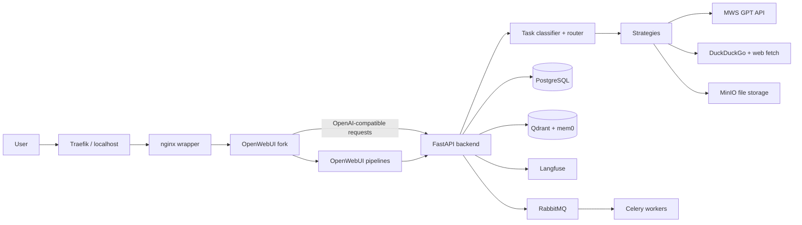

# GPTHub

GPTHub is a pet project for a unified AI workspace built on top of OpenWebUI and MWS GPT. It is a working chat interface that does not force the user to choose a separate service for every task: text, voice, documents, images, search, deep research, presentations, projects, and long-term memory are available from one interface.

The core idea is not a set of buttons around an LLM, but a task router. The user writes a normal prompt or attaches a file, and the backend determines which strategy is needed: a text model, VLM, ASR, image generation, source search, link parsing, or document processing.

## What is implemented

- Multimodal chat: text prompts, image analysis, audio and video through transcription, and questions over PDF/DOCX/TXT/CSV/JSON files.
- Automatic routing: MIME heuristics, prompt-shape analysis, rules for current information, semantic routing through embeddings, and LLM fallback.
- Two model selection modes: `Auto`, where GPTHub selects the strategy and model by itself, and user-controlled `Custom`, where the user manually sets the text model, image model, and audio model.
- Composite requests: the planner can split one user request into several steps, for example generating an image and then analyzing the result.
- Search and web parsing: DuckDuckGo search, page fetching, grounded answers with sources, and citation normalization.
- Deep research: a LangGraph pipeline `plan -> search -> fetch -> rank -> synthesize`, source ranking, and a final answer with links.
- Presentation generation: the LLM creates the slide structure, `python-pptx` builds the `.pptx`, and the artifact is saved in MinIO and made available by link.
- User memory: profile, preferences, and long-term facts through mem0 and Qdrant, plus tools for viewing and deleting memory in OpenWebUI.
- Projects: separate workspace contexts with instructions, binding chats to projects, and passing project instructions to the backend.
- Observability and protection: Langfuse traces, rate limits, request and file size limits, security headers, and quotas for user files.

## Stack

- Backend: Python 3.11, FastAPI, SQLAlchemy, Alembic, Celery, LangGraph, mem0, Qdrant, MinIO, Langfuse.
- Frontend: OpenWebUI fork, Svelte, TypeScript, Tailwind, custom GPTHub components for model routing and projects.
- AI provider: MWS GPT through an OpenAI-compatible API: `/v1/chat/completions`, `/v1/models`, `/v1/embeddings`, audio, image generation.
- Infra: Docker Compose, Traefik, nginx, PostgreSQL, Redis, RabbitMQ, ClickHouse, Flower.

## Architecture



## Model selection modes

The OpenWebUI interface includes a GPTHub selector with two modes:

- `Auto` - the user works as in a regular chat, while the backend determines the task type and chooses the appropriate model or tool by itself.
- `Custom` - the user configures three independent slots: `Text` for text responses, `Image` for image analysis or generation, and `Audio` for audio/transcription.

In `Custom` mode, the selected slots are passed to the backend through metadata (`gpthub_model_mode`, `gpthub_routing_models`). The backend stores the user's choice, but checks model compatibility with the scenario: for example, it prevents sending image generation to a model without image-generation capability and suggests available alternatives.

### How a request flows

1. OpenWebUI sends the request to the backend as an OpenAI-compatible `/v1/chat/completions` request.
2. The backend normalizes the request body and extracts the latest user text, files, project instructions, and memory context.
3. `ModelRouter` selects a strategy based on file type, URL, search signals, runtime questions, embeddings, or an LLM classifier.
4. The strategy calls MWS GPT or an external tool, builds the response, and returns metadata: model, task type, routing method, confidence, sources, and file/image URL.
5. OpenWebUI shows the response in the familiar chat interface, while the GPTHub indicator explains which model and strategy were used.

## Main backend strategies

| Strategy        | Purpose                                                                                                          |
| --------------- | ---------------------------------------------------------------------------------------------------------------- |
| `text`          | Regular text responses with project context, memory, dialog history, and the current server date.                 |
| `vision`        | Analysis of one or more images, with additional audio context when needed.                                        |
| `audio`         | Audio transcription through ASR and further transcript analysis with a text model.                                |
| `file_qa`       | Text extraction from documents, chunking, embeddings, and selection of relevant fragments.                        |
| `image_gen`     | Image generation through MWS GPT and returning the result as a markdown image.                                    |
| `search`        | Web search, answer synthesis, and a sources block.                                                               |
| `web_parse`     | URL fetching, HTML cleanup, and page text analysis.                                                              |
| `deep_research` | Multi-step research with a plan, search, page fetching, ranking, and a final grounded answer.                     |
| `presentation`  | Generation of the structure, design, and `.pptx` file.                                                           |
| `runtime`       | Direct answers to questions about the current server date and time without calling an LLM.                        |

## Default models

All model requests go through MWS GPT. Values can be changed in `.env`.

| Scenario                  | Variable                          | Model                       |
| ------------------------- | --------------------------------- | --------------------------- |
| Text                      | `DEFAULT_TEXT_MODEL`              | `qwen2.5-72b-instruct`      |
| Text fallback             | `FALLBACK_TEXT_MODEL`             | `mws-gpt-alpha`             |
| Vision                    | `VISION_MODEL`                    | `qwen3-vl-30b-a3b-instruct` |
| Vision fallback           | `VISION_FALLBACK_MODEL`           | `cotype-pro-vl-32b`         |
| ASR                       | `ASR_MODEL`                       | `whisper-turbo-local`       |
| Image generation          | `IMAGE_GENERATION_MODEL`          | `qwen-image-lightning`      |
| Image generation fallback | `IMAGE_GENERATION_FALLBACK_MODEL` | `qwen-image`                |
| Embeddings                | `EMBEDDING_MODEL`                 | `bge-m3`                    |
| TTS                       | `TTS_MODEL`                       | `tts-1`                     |

## Project structure

```text
.
|-- backend/                 # FastAPI backend, task routing, strategies, memory, storage, tests
|   |-- app/
|   |   |-- api/             # HTTP API: chat, models, files, memory, workspaces, analytics
|   |   |-- core/            # classifier, router, model catalog, limits, middleware
|   |   |-- strategies/      # text, vision, audio, file_qa, image_gen, search, deep_research
|   |   |-- memory/          # user profile and long-term memory
|   |   |-- providers/       # MWS GPT and web search clients
|   |   |-- storage/         # PostgreSQL models and MinIO file storage
|   |   `-- tasks/           # Celery tasks for heavy scenarios
|   |-- tests/               # unit/integration tests for backend logic
|   `-- alembic/             # PostgreSQL migrations
|-- frontend/
|   |-- openwebui-builder/   # building the custom OpenWebUI image from the fork
|   |-- static/              # GPTHub CSS/JS on top of OpenWebUI
|   |-- pipelines/           # OpenWebUI pipelines for backend integration
|   |-- functions/           # memory and project tools inside OpenWebUI
|   `-- init/                # initial OpenWebUI setup and tools registration
|-- traefik/                 # reverse proxy configuration
|-- docker-compose.yml       # full local environment
`-- .env.example             # environment variable example
```

An OpenWebUI fork is also used: [github.com/anryisreal/open-webui](https://github.com/anryisreal/open-webui). The frontend is built from this fork through the `OPENWEBUI_GIT_REPO` and `OPENWEBUI_GIT_REF` variables, while the nginx wrapper injects `frontend/static/custom.css` and `frontend/static/custom.js` to add branding, routing indicators, and UI adjustments without manual setup after launch.

## Run

Copy the environment example:

```bash
cp .env.example .env
```

After that, open `.env` and fill in the MWS GPT key:

```env
MWS_GPT_API_KEY=
```

For a clean build:

```bash
docker compose build --no-cache
docker compose up
```

For later launches, this is usually enough:

```bash
docker compose up
```

## Login

- Main entry point: [http://localhost](http://localhost)
- Administrator login: `admin@gpthub.local`
- Administrator password: `change_me_admin`

## Ports

| URL                                              | Purpose                                         |
| ------------------------------------------------ | ----------------------------------------------- |
| [http://localhost](http://localhost)             | Main entry point through Traefik.               |
| [http://localhost:3000](http://localhost:3000)   | Frontend nginx directly.                        |
| [http://localhost:8000](http://localhost:8000)   | FastAPI backend directly.                       |
| [http://localhost:8081](http://localhost:8081)   | Traefik dashboard, routes, and services.        |
| [http://localhost:3001](http://localhost:3001)   | Langfuse, request tracing, and observability.   |
| [http://localhost:5555](http://localhost:5555)   | Flower, background tasks, and Celery workers.   |
| [http://localhost:9001](http://localhost:9001)   | MinIO Console, files, and artifacts.            |
| [http://localhost:15672](http://localhost:15672) | RabbitMQ Management, queues, and broker.        |
| [http://localhost:6333](http://localhost:6333)   | Qdrant, vector memory storage.                  |
| [http://localhost:9099](http://localhost:9099)   | OpenWebUI pipelines.                            |

PostgreSQL `5432`, Redis `6379`, RabbitMQ AMQP `5672`, MinIO API `9000`, and ClickHouse HTTP `8123` are also exposed externally.

## Development

The backend is located in `backend/app`. Main entry points:

- `app/main.py` - FastAPI app and router setup.
- `app/api/v1/chat.py` - OpenAI-compatible chat endpoint.
- `app/core/router.py` and `app/core/classifier.py` - model and strategy selection.
- `app/strategies/*` - scenario implementations.
- `app/memory/*` - user profile and long-term memory.
- `app/storage/*` - PostgreSQL models and MinIO files.

Frontend adjustments live in the `open-webui` fork: the GPTHub model selector, projects, and passing `gpthub_model_mode`, `gpthub_routing_models`, and `workspace_id` in request metadata.

Backend tests:

```bash
cd backend
python -m pytest
```

## Status

The project is in a working MVP state: the core infrastructure starts through Docker Compose, OpenWebUI is connected to the custom backend, and the key scenarios for multimodal chat, routing, memory, projects, search, and artifact generation are assembled into one user flow.
